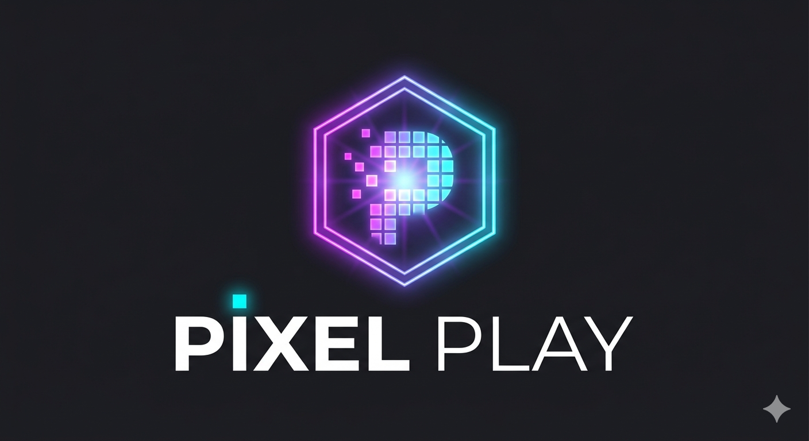
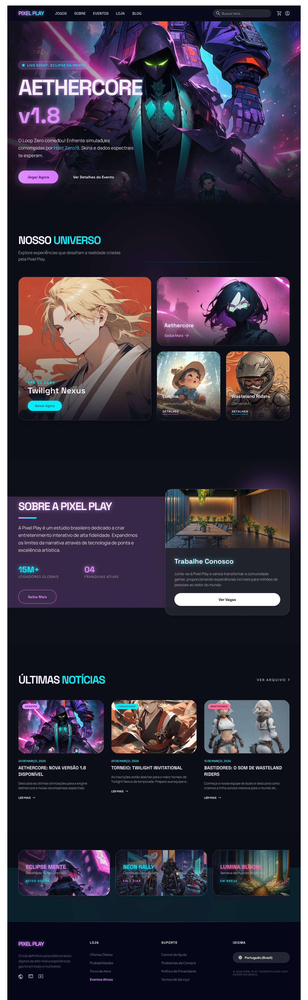
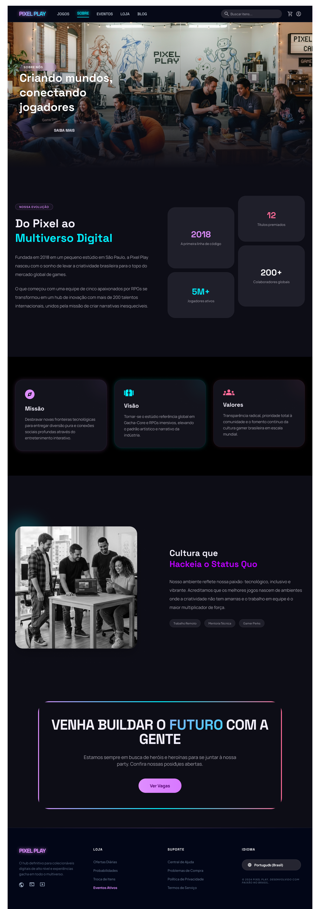
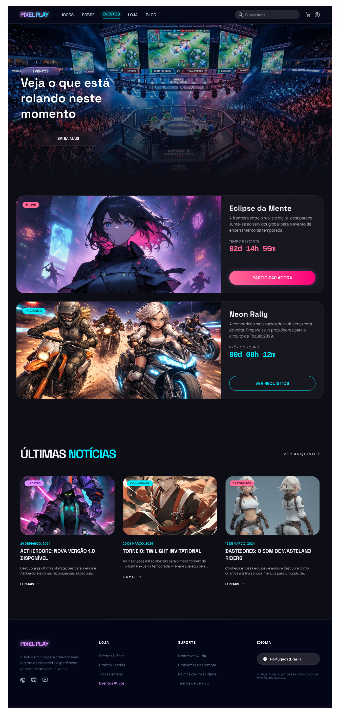
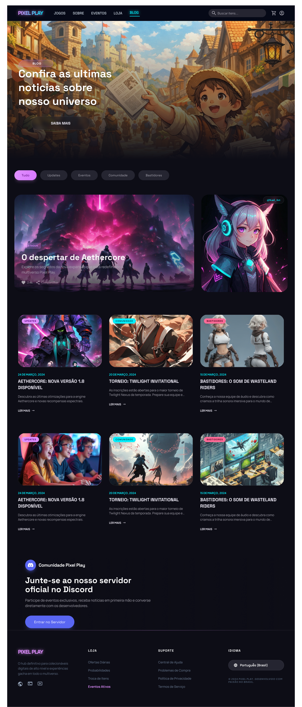
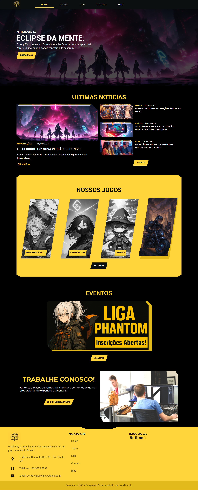
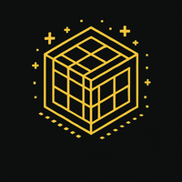

# PixelPlay

  <b>Plataforma web para estúdio de jogos fictício</b> 
  Explorando design, arquitetura e experiência do usuário

  

## 🔗 Acesse o projeto

  <a href="https://pixelplaystudio.vercel.app/"><b>🌐 Deploy</b></a> •
  <a href="https://www.figma.com/design/H3BRyJH3eGSOOojpH4b1f7/PixelPlay-Studio"><b>🎨 Figma</b></a>

## Introdução

### 🧠 Sobre o projeto
O *PixelPlayStudio* é uma empresa ficticia criada como projeto pessoal com foco em desenvolvimento web.
Este projeto surgiu da minha paixão por jogos e da vontade de construir algo que, mais do que um simples portfólio, algo que me desafiasse tecnicamente, mas que também fosse divertido e criativo.

### 🎯 Objetivo
Simular um cenário real, onde a empresa *PixelPlay Studio* me contratou como desenvolvedor para criar sua página oficial. O objetivo do site é apresentar o estudio, divulgar seus jogos, anunciar eventos, lançamentos e oferecer uma loja online para venda de itens, skins e moedas dos jogos.

### 🤖 Diferencial
Todo universo da empresa - incluindo a história da marca, logo, lore dos jogos, personagens, imagens e narrativas - foi desenvolvido com apoio de IA, tornando a experiência de desenvolvimento ainda mais rica, criativa e desafiadora.
Este projeto continuará sendo desenvolvido e aprimorado constantemente, funcionando como um laboratório vivo para práticas de desenvolvimento, design e arquitetura de software.

## 🧭 Status do Projeto
🛠️ Em desenvolvimento contínuo

## 📜 Escopo do Projeto
* Desenvolver um website institucional para uma empresa fictícia de jogos, a PixelPlay;
* Praticar e aprimorar habilidades em desenvolvimento web;
* Exercitar integração com IA para geração de conteúdo, tanto textual quanto visual;
* Aprimorar experiência real de desenvolvimento profissional, desde o levantamento de requisitos até a entrega de um produto funcional e escalável.

### Tecnologias e Recursos
Abaixo, listo todas as tecnologias e bibliotecas utilizadas:

* **React.js:** para criação de interfaces mais intuitiva e eficiente, com a utilização de componentes reutilizáveis, facilitando a manutenção e escalabilidade do projeto.
* **Typescript:** para ajudar a prevenir erros comuns em Javascript, como erros de tipo e nulos, tornando o código mais confiável, auxiliando a identificação de erros em tempo de desenvolvimento.
* **Material UI:** para agilizar o desenvolvimento da estilização de componentes
* **Inteligência Artificial:** ChatGPT para apoio na geração de conteúdo textual (histórias, descrições, lore); Gemini para geração de imagens; Stitch para geração do layout das páginas e Kiro para apoio no desenvolvimento.

## 🎨 Layout
O design do PixelPlay foi pensado para transmitir uma experiência moderna, imersiva e alinhada ao universo gamer, utilizando contrastes fortes, cores vibrantes e tipografia limpa para maximizar legibilidade e impacto visual.

### 🎨 Paleta de cores
<table>
  <tr>
    <td align="center">
      

      <b>Primary</b> 
      <code>#BD00FF</code>
    </td>
    <td align="center">
      

      <b>Secondary</b> 
      <code>#00F0FF</code>
    </td>
    <td align="center">
      

      <b>Tertiary</b> 
      <code>#FF007A</code>
    </td>
    <td align="center">
      

      <b>Neutral</b> 
      <code>#0A0A12</code>
    </td>
  </tr>
</table>

### 🔤 Tipografia
<table> <tr> <td align="center"> <b>Headline</b>  Space Grotesk  Uso em títulos e destaque visual </td> <td align="center"> <b>Body</b>  Manrope  Leitura contínua e conteúdo </td> <td align="center"> <b>Label</b>  Plus Jakarta Sans  Botões e elementos de UI </td> </tr> </table>

### 🖼️ Figma

<table>
  <tr>
    <td align="center" valign="top" width="33%">
      <b>Homepage</b> 
       
    </td>
    <td align="center" valign="top" width="33%">
      <b>Catálogo de Jogos</b> 
       
    </td>
    <td align="center" valign="top" width="33%">
      <b>Jogo Individual</b> 
       
    </td>
  </tr>

  <tr>
    <td align="center" valign="top">
      <b>Sobre</b> 
       
    </td>
    <td align="center" valign="top">
      <b>Eventos</b> 
       
    </td>
    <td align="center" valign="top">
      <b>Evento Individual</b> 
       
    </td>
  </tr>

  <tr>
    <td align="center" valign="top">
      <b>Loja</b> 
       
    </td>
    <td align="center" valign="top">
    <b>Blog</b> 
       
    </td>
  </tr>
</table>

## 📢 Últimas atualizações
* **Versão:** 2.0
* **Data de Atualização:** 15/04/2026

| Versão 1.0 | Versão 2.0 |
|-----------|-----------|
|  |  |
|  |  |

## 🤝 Contribuições
Este projeto é pessoal e, no momento, não está aberto para contribuições externas. Porém, feedbacks e sugestões são sempre bem-vindos!

📝 Licença
Este projeto está sob licença MIT.